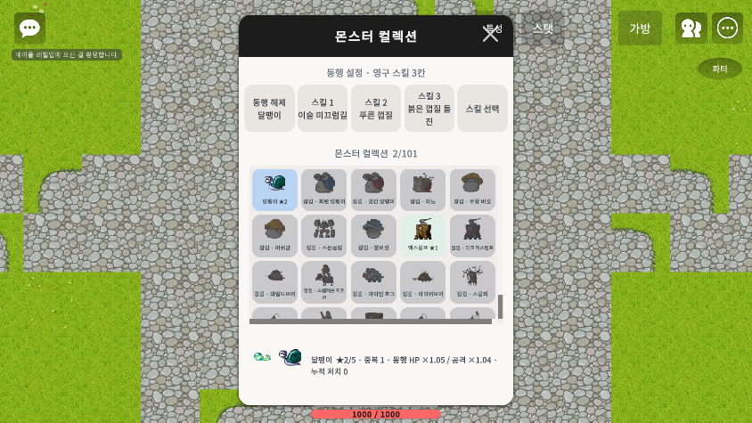
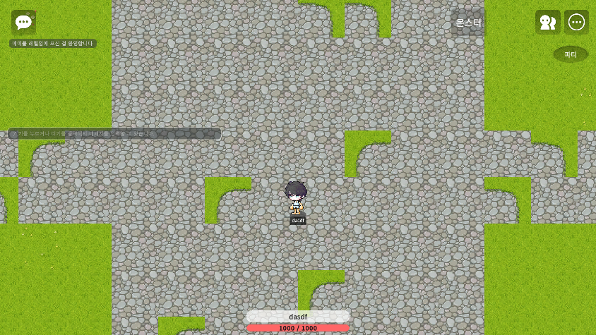

# 몬스터 수집 UI 확인 (Maker Play, 2026-09-27 KST)

- 로비의 기존 스킬 컬렉션 패널을 `몬스터` 진입점으로 재사용한다. 101종 그리드, 미획득 잠금, ★ 단계, 성장 배율, 영구 스킬 선택, 몬스터별 3슬롯과 동행 선택/해제를 표시한다.
- Run에서는 기존 스킬 창과 Random 5 SkillBar를 유지하고 몬스터 Loadout 편집은 숨긴다. 전투 스킬 슬롯과 영구 동행 스킬 슬롯은 별개다.
- 로비에서 선택한 달팽이 ★2와 장착한 직선 공격/방어막/돌진 3종을 화면으로 확인했다. `ui_lobby.png`는 패널, `lobby_clean.png`는 닫힌 상태이다.
- DataSet 준비 전에 UI Logic이 시작하면 예전 `특성·스탯·가방` 버튼이 남는 현상을 Maker에서 재현했다. 각 Logic의 후속 OnUpdate에서 신규 모드를 확인해 창·버튼·입력을 비활성화했다. 수정 후 `lobby_clean.png`에는 `몬스터`, 파티, 시스템 메뉴만 보인다.
- 패널의 작은 글자와 3칸의 긴 스킬명이 여러 줄로 접히는 것은 남은 가독성 문제다. 실제 화면에서 읽기는 가능했으나, 별도의 해상도·모바일 기기별 UI 검증은 하지 않았다.
- UI 메서드를 Maker 실행 컨텍스트에서 호출해 열림/닫힘을 확인했다. Maker 입력 도구는 엔진 관리 UI 버튼 클릭을 지원하지 않으므로 모든 패널 버튼을 실제 포인터로 클릭했다는 의미는 아니다. 서버 장착/선택 요청과 저장은 실제 Run 컨텍스트에서 따로 확인했다.

