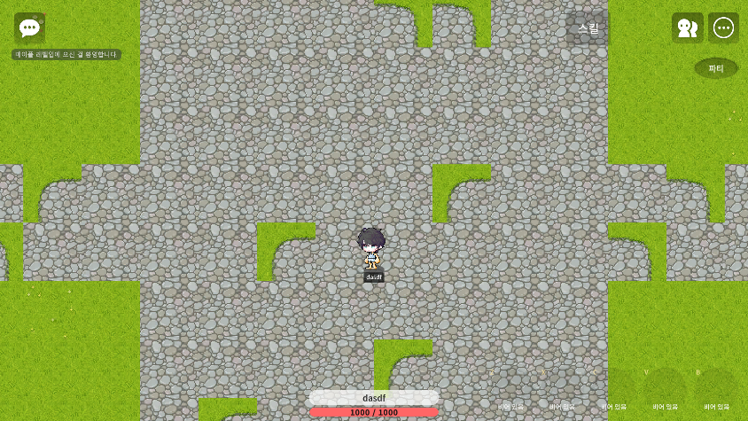
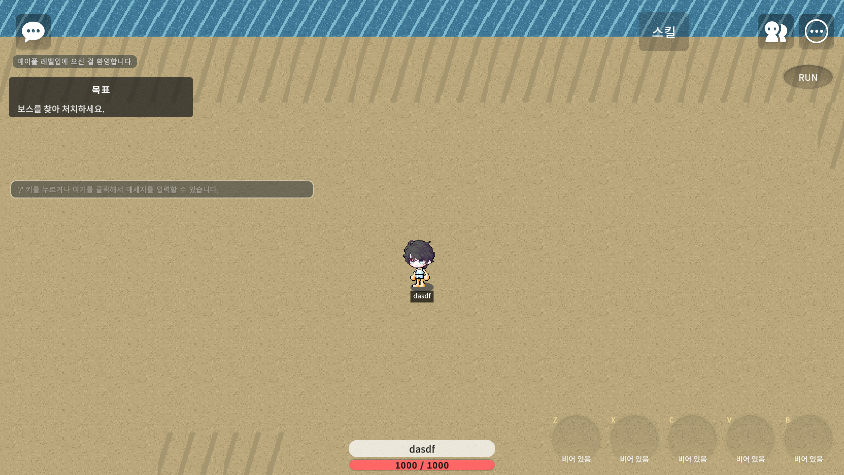
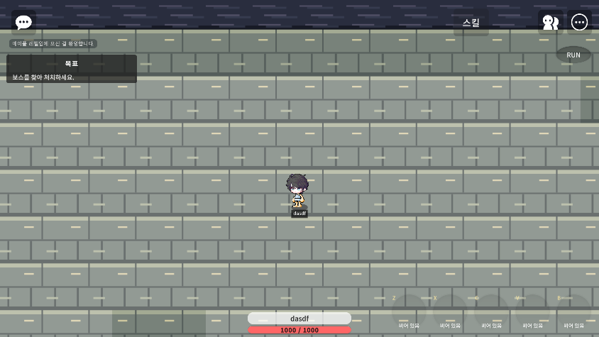

# 로그라이트 UI 잔재 전역 감사 (2026-09-22)

## 요청 화면에서 확인한 문제

- 하단 공용 Player HUD에 `Lv 1`이 노출됐다.
- HP 아래에 EXP 진행처럼 보이는 `0 / 60` 게이지가 노출됐다.
- 플레이어 이름 영역이 레벨 칸을 피하도록 오른쪽으로 30px 치우쳐 있었다.

로그라이트 신규 모드에서 레벨/EXP는 전투력이나 Run 진행에 쓰지 않으므로 시각적 잔재로 판정했다. HP는 Run 생존 판단에 필요한 정보라 유지했다.

## 전체 맵 확인

- `.map` 파일: 163개
- 맵 파일 안에 직접 삽입된 `PlayerHud`, `StatGroup`, `InventoryPanel`, `WorldMapPanel`, `RebirthConfirmPanel`, `TraitPanel`: 0개
- 결론: 하단 상태 UI는 맵별 복제물이 아니라 모든 맵이 공유하는 `ui/PlayerHud.ui` 한 곳에서 렌더링된다.

따라서 공용 PlayerHud를 수정하면 마을, 일반 Room, Instance Run 전부에 동일하게 적용된다. 개별 맵 163개를 수정하지 않았다.

## 제거 또는 유지 처리

| 항목 | 처리 | 근거 |
|---|---|---|
| Level 표시 | 비표시 | 신규 로그라이트 전투에 사용하지 않음 |
| EXP 게이지/수치 | 비표시 | 신규 로그라이트 Run 진행에 사용하지 않음 |
| Player 이름 | 유지, 정확한 중앙 정렬 | 플레이어 식별 정보 |
| HP 게이지/수치 | 유지 | 전투 생존 판단 필수 |
| 고정 SkillBar | 유지 | 핵심 전투 UI |
| Area Objective | 유지 | Run 목표 진행 정보 |
| Boss HUD | 유지 | 보스 조우 전투 정보 |
| Party/RUN 메뉴 | 유지 | 협동 및 Run 포기 UX |
| Stat/Inventory/WorldMap/Trait/Rebirth 파일 | 보존하되 신규 모드 노출 차단 유지 | 기존 저장·레거시 모드 호환 보존 |

## 레이아웃 변경

- Player HUD 전체: `334×104 → 334×72`
- 이름 영역: `200×40`, X `+30` → `334×40`, X `0`
- 이름 텍스트: 수평/수직 중앙 정렬
- Level 엔티티: `Enable=false`
- EXP 루트 엔티티: `Enable=false`
- HP 영역: `334×30`, 하단 중앙 유지

정적 `.ui` 설정과 `PlayerHud.mlua` 런타임 방어 처리를 함께 적용했다. 이전 UI 캐시나 레거시 데이터가 남아도 Level/EXP 엔티티를 다시 켜지 않는다.

## 기존 레거시 UI 확인

다음 파일에는 과거 RPG 문구와 화면 정의가 남아 있다.

- `ui/StatGroup.ui`
- `ui/Inventory.ui`
- `ui/WorldMap.ui`
- `ui/RebirthConfirm.ui`
- `ui/GoddessWindow.ui`

그러나 현재 로그라이트 모드에서는 각 컨트롤러가 창과 열기 버튼을 `Enable=false`로 처리한다. 저장 호환 및 과거 기능 복원을 위해 정의 파일 자체를 삭제하지 않았다.

## Maker Runtime 확인

### 마을

- Level/EXP 표시 없음
- 이름 중앙 정렬
- HP만 유지

### MEGA 01 Run

- Instance Run에서도 동일한 공용 HUD 적용
- Objective, RUN, SkillBar는 정상 유지

### MEGA 05 Run

- 다른 Area 테마에서도 Level/EXP 재노출 없음
- 이름/HP 중앙 정렬 유지

## 검증 결과

- Maker Refresh: 성공
- Build Error: 0
- Runtime Error: 0
- Runtime 로그: `[PlayerHud] 로그라이트 공용 HUD 적용 — 이름/HP만 표시` 확인
- 검증 위치: maptown, MEGA 01 Run, MEGA 05 Run
- 공용 UI 구조상 나머지 맵에도 동일 적용

## 변경 파일

- `ui/PlayerHud.ui`
- `RootDesk/MyDesk/UI/PlayerHud.mlua`
- `docs/tools/rebuild-roguelite-player-hud.cjs`

