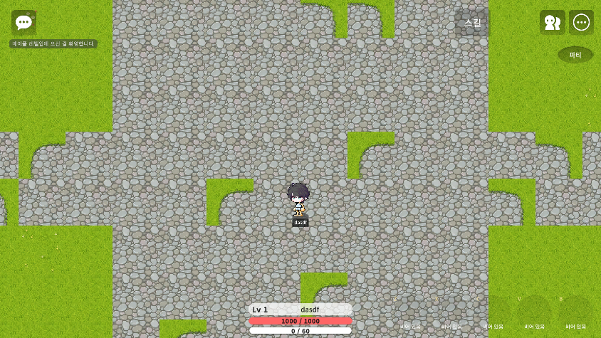
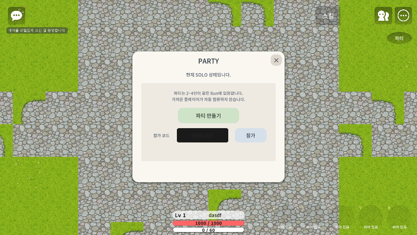
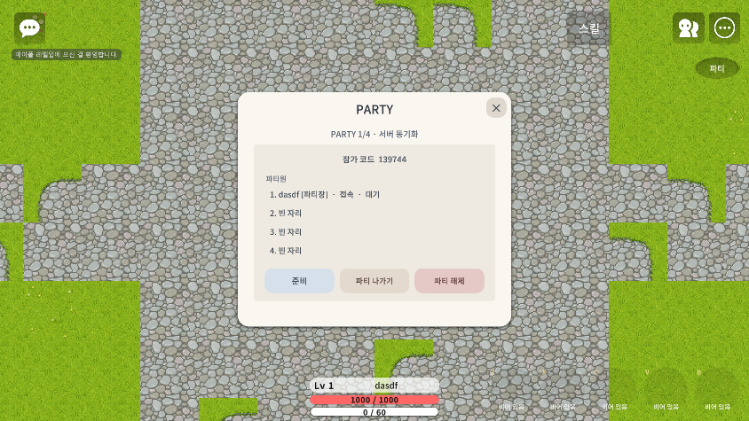
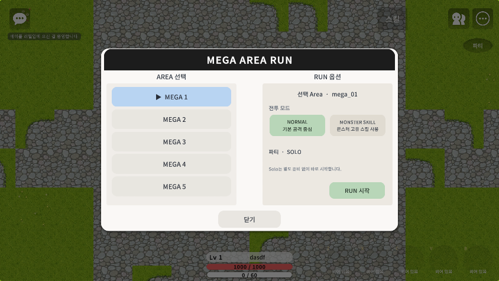
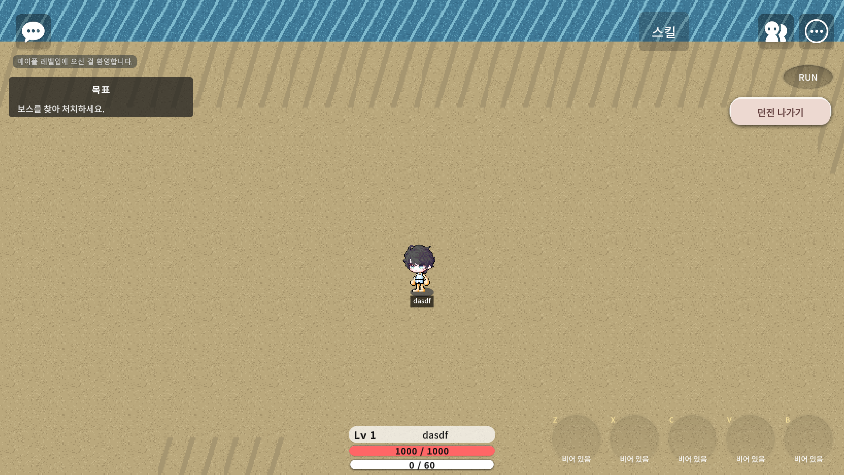
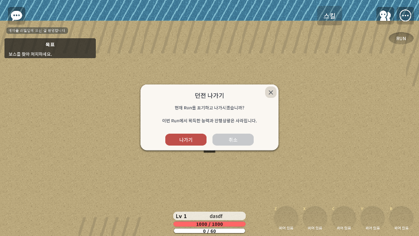

# UI 버튼 크기 및 실제 화면 감사 (2026-09-22)

## 범위

- 대상: `ui/*.ui` 전체 16개 파일
- 정적 확인: `ButtonComponent` 267개
- 실제 화면 확인: 로비 HUD, 파티 참가/생성, 파티 구성 후 메뉴, Area 선택, Run HUD 메뉴, 던전 나가기 확인창
- 캡처 환경: Maker Play, 시뮬레이션 해상도 1920×1080
- 캡처 파일 자체는 Maker 도구가 844×475로 축소 저장하므로, 실제 클릭 영역 판정에는 `.ui`의 `RectSize`도 함께 사용했다.

## 결론

현재 로그라이트 플레이 흐름에서 화면에 노출되는 신규 파티/Run 버튼 가운데 48px 미만 클릭 영역은 없다. 특히 작아 보였던 우측 상단 `파티`와 `RUN` 진입 버튼을 124×60으로 확대했고, 관련 팝업의 닫기/행동 버튼도 최소 52px 높이를 확보했다.

정적 검사에서 48px 미만으로 남은 9개 항목은 현재 로그라이트 모드에서 비활성화되는 레거시 Inventory 필터 5개와 WorldMap 컨트롤 4개다. 이번 수정에서는 현재 보이지 않는 레거시 화면까지 임의 재설계하지 않았다.

## 변경한 버튼

| 화면 | 버튼 | 변경 전 | 변경 후 | 판정 |
|---|---|---:|---:|---|
| 로비 HUD | 파티 | 66×36 | 124×60 | 정상 |
| 파티 참가 | 파티 만들기 | 260×64 | 280×70 | 정상 |
| 파티 참가 | 참가 | 138×58 | 148×64 | 정상 |
| 파티 참가 | 참가 코드 입력 영역 | 230×58 | 238×64 | 정상 |
| 파티 관리 | 준비 | 170×58 | 178×64 | 정상 |
| 파티 관리 | 파티 나가기 | 170×58 | 178×64 | 정상 |
| 파티 관리 | 파티 해체 | 170×58 | 178×64 | 정상 |
| 파티 팝업 | 닫기 | 44×44 | 52×52 | 정상 |
| Run HUD | RUN | 66×36 | 124×60 | 정상 |
| Run 메뉴 | 던전 나가기 | 202×46 | 226×58 | 정상 |
| 나가기 확인창 | 닫기 | 42×42 | 52×52 | 정상 |
| 나가기 확인창 | 나가기/취소 | 190×54 | 190×54 | 기존부터 충분 |

## 실제 화면 캡처

### 1. 로비 HUD

- 우측 상단의 파티 진입 버튼이 기존 66×36보다 넓어져 다른 상단 시스템 버튼과 명확히 구분된다.
- 하단 고정 스킬 슬롯은 잘림 없이 표시된다.

### 2. 파티 참가/생성

- `파티 만들기`, 참가 코드 입력, `참가`, 닫기 버튼 모두 충분한 높이를 확보했다.
- 라벨 잘림이나 버튼 간 겹침은 보이지 않았다.

### 3. 파티 구성 후 관리

- `준비`, `파티 나가기`, `파티 해체`가 동일 계열 크기로 정렬됐다.
- 세 버튼 사이 간격과 경고색 구분이 유지된다.

### 4. Area 선택

- Area 카드 5개, 전투 모드 2개, `RUN 시작`, `닫기`를 함께 확인했다.
- 실제 화면에서 작은 클릭 영역, 텍스트 잘림, 상호 겹침은 발견되지 않았다.

### 5. Run 메뉴

- 우측 상단 `RUN` 버튼과 펼쳐진 `던전 나가기` 버튼을 확인했다.
- 전투 시야를 과도하게 덮지 않으면서 클릭 영역은 확대됐다.

### 6. 던전 나가기 확인창

- 닫기, `나가기`, `취소` 버튼이 모두 확인 가능하다.
- 문구 및 버튼 라벨 잘림은 없고, 확인/취소의 색 구분도 유지된다.

## 남아 있는 작은 레거시 버튼

정적 기준(가로 또는 세로 48px 미만)으로 남은 항목은 다음 범주뿐이다.

- Inventory 필터 버튼 5개: 116×40
- WorldMap 레거시 컨트롤 4개: 38×38, 20×20, 38×38, 11×70

현재 로그라이트에서는 Inventory/WorldMap 레거시 패널이 비활성화되어 이번 실제 화면 캡처에 나타나지 않는다. 해당 화면을 다시 사용하게 될 때 별도 터치 타깃 보정이 필요하다.

## 검증 결과

- Maker Refresh: 성공
- Build: Error 0
- Build 경고: 기존 `mano/MovementComponent.InputSpeed`, `bowmaster/MonsterAttack.AvatarAttackPlayRate` 2건 유지
- Runtime Error: 0 (`Info` 2749, `Warning` 72, `Error` 0)
- 실제 캡처 확인: 6개 화면 완료
- 커밋: 수행하지 않음

## 변경 파일

- `ui/PlayerHud.ui`
- `ui/AreaSelect.ui` (파티 UI 재생성 스크립트의 멱등 출력)
- `docs/tools/rebuild-party-area-ui.cjs`
- `docs/tools/rebuild-run-abandon-ui.cjs`

